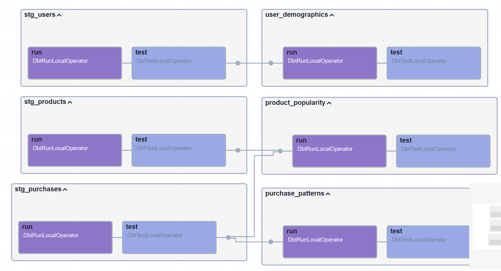

# E-commerce Analytics Stack with Airbyte, dbt, Airflow (ADA) and Teradata

Welcome to the Airbyte, dbt and Airflow (ADA) Stack with Teradata quickstart! This repo contains the code to show how to utilize Airbyte and dbt for data extraction and transformation, and implement Apache Airflow to orchestrate the data workflows, providing a end-to-end ELT pipeline. With this setup, you can pull fake e-commerce data, put it into Teradata, and play around with it using dbt and Airflow.

Here's the diagram of the end to end data pipeline you will build, from the Airflow DAG Graph view:


And here are the transformations happening when the dbt DAG is executed:



## Table of Contents

- [Prerequisites](#prerequisites)
- [Setting an environment for your project](#1-setting-an-environment-for-your-project)
- [Setting Up Teradata Instance](#2-setting-up-teradata)
- [Setting Up Airbyte Connectors](#3-setting-up-airbyte-connectors)
- [Setting Up the dbt Project](#4-setting-up-the-dbt-project)
- [Setting Up Airflow](#5-setting-up-airflow)
- [Orchestrating with Airflow](#6-orchestrating-with-airflow)
- [Next Steps](#7-next-steps)

## Prerequisites

Before you embark on this integration, ensure you have the following set up and ready:

1. **Python 3.10 or later**: If not installed, download and install it from [Python's official website](https://www.python.org/downloads/).

2. **Docker and Docker Compose (Docker Desktop)**: Install [Docker](https://docs.docker.com/get-docker/) following the official documentation for your specific OS.

3. **Airbyte OSS version**: Deploy the open-source version of Airbyte locally. Follow the installation instructions from the [Airbyte Documentation](https://docs.airbyte.com/quickstart/deploy-airbyte/).

4. **Teradata Vantage Instance** Request test Teradata Vantage instance from https://clearscape.teradata.com/

## 1. Setting an environment for your project

Get the project up and running on your local machine by following these steps:

1. **Clone the repository (Clone only this quickstart)**:  
   ```bash
   git clone --filter=blob:none --sparse  https://github.com/teradata/quickstarts.git
   ```

   ```bash
   cd quickstarts
   ```

   ```bash
   git sparse-checkout add airbyte_dbt_airflow_teradata
   ```

2. **Navigate to the directory**:  
   ```bash
   cd airbyte_dbt_airflow_teradata
   ```

   At this point you can view the code in your preferred IDE. 
   
   The next steps are only necessary if want to develop or test the dbt models locally, since Airbyte and Airflow are running on Docker.

## 2. Setting up Teradata Instance

Follow the instructions - https://quickstarts.teradata.com/getting-started-with-csae.html

## Setting Up Airbyte Instance

Deploy the open-source version of Airbyte locally. Follow the installation instructions from the [Airbyte Documentation](https://docs.airbyte.com/quickstart/deploy-airbyte/).


## 3. Setting Up Airbyte Connectors

Start by launching the Airbyte UI by going to http://localhost:8000/ in your browser. Then:

1. **Create a source**:

   - Go to the Sources tab and click on `+ New source`.
   - Search for “faker” using the search bar and select `Sample Data (Faker)`.
   - Adjust the Count and optional fields as needed for your use case. You can also leave as is. 
   - Click on `Set up source`.

2. **Create a destination**:

   - Go to the Destinations tab and click on `+ New destination`.
   - Search for “teradata” using the search bar and select `Teradata Vantage`.
   - Enter the connection details as needed.
   - Click on `Set up destination`.

3. **Create a connection**:

   - Go to the Connections tab and click on `+ New connection`.
   - Select the source and destination you just created.
   - Enter the connection details as needed.
   - Click on `Set up connection`.

That’s it! Your connection is set up and ready to go! 🎉 

## 4. Setting Up the dbt Project

[dbt (data build tool)](https://www.getdbt.com/) allows you to transform your data by writing, documenting, and executing SQL workflows. Setting up the dbt project requires specifying connection details for your data platform, in this case, Teradata. Here’s a step-by-step guide to help you set this up:

1. **Navigate to the dbt Project Directory**:

   Move to the directory containing the dbt configuration:
   ```bash
   cd ../../dbt_project
   ```

2. **Update Connection Details**:

   - You'll find a `profiles.yml` file within the directory. This file contains configurations for dbt to connect with your data platform. Update this file with your Teradata connection details. 
   - Provide below details
     - **host**: Teradata Instance host name
     - **schema**: database name. Provide this database name in the `database` field of the `/models/ecommerce/sources/faker_sources.yml` file.
     - **user**: database user.
     - **password**: database password.

3. **Test the Connection (Optional)**:
   You can test the connection to your Teadata instance using the following command. Just take into account that you would need to provide the local path to your service account key file instead.
   
   ```bash
   dbt debug
   ```
   
   If everything is set up correctly, this command should report a successful connection to Teradata 🎉.

## 5. Setting Up Airflow

Let's set up Airflow for our project, following the steps below. We are basing our setup on the Running Airflow in Docker guide, with some customizations:

1. **Navigate to the Orchestration Directory**:

   ```bash
   cd ../orchestration
   ```

2. **Set Environment Variables**:

   - Open the `.env.example` file located in the `orchestration` directory.
   - Rename the file from `.env.example` to `.env` after filling in the details.

3. **Build the custom Airflow image**:

   ```bash
   docker compose build
   ```

4. **Launch the Airflow container**:

   ```bash
   docker compose up
   ```

   This might take a few minutes initially as it sets up necessary databases and metadata.

5. **Setting up Airflow Connections**:

   Both for using Airbyte and dbt, we need to set up connections in Airflow:

   - Access the Airflow UI by navigating to `http://localhost:8080` in your browser. The default username and password are both `airflow`, unless you changed it on the `.env` file.
   - Go to the "Admin" > "Connections" tab.

   **5.1. Create Airbyte Connection**:

      Click on the `+` button to create a new connection and fill in the following details to create an Airbyte connection:

      - **Connection Id**: The name of the connection, this will be used in the DAGs responsible for triggering Airbyte syncs. Name it `airbyte_connection`.
      - **Connection Type**: The type of the connection. In this case, select `Airbyte`.
      - **Host**: The host of the Airbyte instance. Since we're running it locally, use `airbyte-proxy`, which is the name of the container running Airbyte. In case you have a remote instance, you can use the URL of the instance.
      - **Port**: The port of the Airbyte instance. By default the API is exposed on port `8001`.
      - **Login**: If you're using the proxy (it's used by default in the official Airbyte Docker Compose file), this is required. By default it's `airbyte`.
      - **Password**: If you're using the proxy (it's used by default in the official Airbyte Docker Compose file), this is required. By default it's `password`.

      Click on the `Test` button, and make sure you get a `Connection successfully tested` message at the top. Then, you can `Save` the connection.

6. **Integrate dbt with Airflow**:

   

7. **Link Airbyte connection to the Airflow DAG**:

   The last step being being able to execute the DAG in Airflow, is to include the `connection_id` from Airbyte:

   - Visit the Airbyte UI at http://localhost:8000/.
   - In the "Connections" tab, select the "Faker to Teradata" connection and copy its connection id from the URL.
   - Update the `connection_id` in the `extract_data` task within `orchestration/airflow/dags/elt_dag.py` with this id.

   That's it! Airflow has been configured to work with dbt and Airbyte. 🎉 

## 6. Orchestrating with Airflow
Now that everything is set up, it's time to run your data pipeline!

- In the Airflow UI, go to the "DAGs" section.
- Locate `elt_dag` and click on "Trigger DAG" under the "Actions" column.

This will initiate the complete data pipeline, starting with the Airbyte sync from Faker to Teradata, followed by dbt transforming the raw data into `staging` and `marts` models.

- Confirm the sync status in the Airbyte UI.
- After dbt jobs completion, check the Teradata to see the newly created views in the `transformed_data` dataset. This can be done by using Teradata Studio or other database client UI tools.

Congratulations! You've successfully run an end-to-end workflow with Airflow, dbt and Airbyte. 🎉

## 7. Next Steps

Once you've gone through the steps above, you should have a working Airbyte, dbt and Airflow (ADA) Stack with Teradata. You can use this as a starting point for your project, and adapt it to your needs.