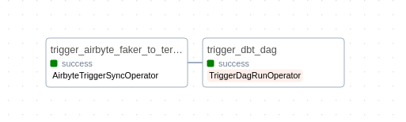

# E-commerce Analytics Stack with Airbyte, dbt, Airflow (ADA) and Teradata

Welcome to the quickstart guide for the Airbyte, dbt, and Airflow (ADA) Stack with Teradata! This repository provides the code needed to leverage Airbyte and dbt for data extraction and transformation, while using Apache Airflow to orchestrate your data workflows, creating a complete end-to-end ELT pipeline. With this setup, you can import synthetic e-commerce data into Teradata and explore it using dbt and Airflow.

Here's the diagram of the end to end data pipeline you will build, from the Airflow DAG Graph view:



And here are the transformations happening when the dbt DAG is executed:


## Table of Contents

- [Prerequisites](#prerequisites)
- [Setting an Environment](#setting-an-environment)
- [Setting Up Teradata Instance](#setting-up-teradata-instance)
- [Setting Up Airbyte Instance](#setting-up-airbyte-instance)
- [Setting Up the dbt Project](#setting-up-the-dbt-project)
- [Setting Up Airflow](#setting-up-airflow)
- [Orchestrating with Airflow](#orchestrating-with-airflow)
- [Next Steps](#next-steps)
- [Troubleshooting](#troubleshooting)


> **Note:**: Use `https://learn.microsoft.com/en-us/windows/wsl/install[The Windows Subsystem for Linux (WSL)]` on `Windows` to try  this quickstart.


## Prerequisites

Before you embark on this integration, ensure you have the following set up and ready:

- **Python 3.10 or later**: If not installed, download and install it from [Python's official website](https://www.python.org/downloads/).
- **Docker and Docker Compose (Docker Desktop)**: Install [Docker](https://docs.docker.com/get-docker/) following the official documentation for your specific OS.


## Setting an environment

Get the project up and running on your local machine by following these steps:

- **Clone the repository**:  
   ```bash
   git clone https://github.com/Teradata/airflow-demos.git
   ```

   ```bash
   cd airflow-demos
   ```
- **Navigate to the directory**:  
   ```bash
   cd airbyte_dbt_airflow_teradata
   ```

   At this point you can view the code in your preferred IDE. 

## Setting up Teradata Instance

Follow the instructions - https://quickstarts.teradata.com/getting-started-with-csae.html

## Setting Up Airbyte Instance

Deploy the open-source version of Airbyte locally. Follow the installation instructions from the [Airbyte Documentation](https://docs.airbyte.com/using-airbyte/getting-started/oss-quickstart).

### Setting Up Airbyte Connectors

Start by launching the Airbyte UI by going to http://localhost:8000/ in your browser. Then:

- **Create a source**

   - Go to the Sources tab and click on `+ New source`.
   - Search for “faker” using the search bar and select `Sample Data (Faker)`.
   - Adjust the Count and optional fields as needed for your use case. You can also leave as is. 
   - Click on `Set up source`.

- **Create a destination**

   - Go to the Destinations tab and click on `+ New destination`.
   - Search for “teradata” using the search bar and select `Teradata Vantage`.
   - Enter the connection details as needed.
     - Host: Teradata instance hostname to connect to.
     - User: Specify the user name to connect.
     - Password: Specify the password to connect.
     - Default Schema: ecommerce
   - Click on `Set up destination`.

- **Create a connection**

   - Go to the Connections tab and click on `+ New connection`.
   - Select the source and destination you just created.
   - Enter the connection details as needed.
   - Click on `Set up connection`.

That’s it! Your connection is set up and ready to go! 🎉 

## Setting Up the dbt Project

- **Navigate to the dbt Project Directory**

   Move to the directory containing the dbt configuration:
   ```bash
   cd dbt_project
   ```

- **Update faker schema Details**

   Update `schema` field under `sources` section with schema name used in Airbyte Destination Teradata connection. Default is `ecommerce`

## Setting Up Airflow

Let's set up Airflow for our project, following the steps below. We are basing our setup on the Running Airflow in Docker guide, with some customizations:

- **Navigate to the Orchestration Directory**

   ```bash
   cd ../orchestration
   ```

- **Set Environment Variables**

   - Rename the file from `.env.example` to `.env`.

- **Build the custom Airflow image**

   ```bash
   docker compose build
   ```

- **Launch the Airflow container**

   ```bash
   docker compose up
   ```

   This might take a few minutes initially as it sets up necessary databases and metadata.

- **Setting up Airflow Connections**

   Both for using Airbyte and dbt, we need to set up connections in Airflow:

   - Access the Airflow UI by navigating to `http://localhost:8080` in your browser. The default username and password are both `airflow`, unless you changed it on the `.env` file.
   - Go to the "Admin" > "Connections" tab.

   - **Create Airbyte Connection**

      Click on the `+` button to create a new connection and fill in the following details to create an Airbyte connection:

      - **Connection Id**: Unique ID of Airbyte Connection, this will be used in the DAGs responsible for triggering Airbyte syncs. Name it `airbyte_connection`.
      - **Connection Type**: The type of the connection. In this case, select `Airbyte`.
      - **Host**: The host of the Airbyte instance. Since we're running it locally, use `host.docker.internal`. In case you have a remote instance, you can use the URL of the instance.
      - **Port**: The port of the Airbyte instance. By default the API is exposed on port `8000`.
      - **Login**: Provide email configured through airbyte `abctl`
      - **Password**: Provide password configured through airbyte `abctl`. Refer https://docs.airbyte.com/using-airbyte/getting-started/oss-quickstart

      Click on the `Test` button, and make sure you get a `Connection successfully tested` message at the top. Then, you can `Save` the connection.

   - **Create Teradata Connection**

      Click on the `+` button to create a new connection and fill in the following details to create Teradata connection:
      - **Connection Id**: Unique ID of Teradata Connection. Name it `teradata_connection`.
      - **Connection Type**: Type of the system. Select Teradata.
      - **Database Server URL (required)**: Teradata instance hostname to connect to.
      - **Database (optional)**: Specify the name of the database to connect to. Specify `ecommerce`
      - **Login (required)**: Specify the user name to connect.
      - **Password (required)**: Specify the password to connect.

      Click on the `Test` button, and make sure you get a `Connection successfully tested` message at the top. Then, you can `Save` the connection.

- **Link Airbyte connection to the Airflow DAG**

   The last step being being able to execute the DAG in Airflow, is to include the `connection_id` from Airbyte:

   - Visit the Airbyte UI at http://localhost:8000/.
   - In the "Connections" tab, select the "Faker to Teradata" connection and copy its connection id from the URL.
   - Update the `connection_id` in the `extract_data` task within `orchestration/airflow/dags/elt_dag.py` with this id.

   That's it! Airflow has been configured to work with dbt and Airbyte. 🎉

## Orchestrating with Airflow
Now that everything is set up, it's time to run your data pipeline!

- In the Airflow UI, go to the "DAGs" section.
- Local and Enable `elt_dat` and `dbt_ecommerce` dags in UI.
- click on "Trigger DAG" of `elt_dag` under the "Actions" column.

This will initiate the complete data pipeline, starting with the Airbyte sync from Faker to Teradata, followed by dbt transforming the raw data into `staging` and `agreegate` models.

- Confirm the sync status in the Airbyte UI.
- After dbt jobs completion, check the Teradata to see the newly created views and tables in the specified schema. This can be done by using Teradata Studio or other database client UI tools.

Congratulations! You've successfully run an end-to-end workflow with Airflow, dbt and Airbyte. 🎉

## Next Steps

Once you've gone through the steps above, you should have a working Airbyte, dbt and Airflow (ADA) Stack with Teradata. You can use this as a starting point for your project, and adapt it to your needs.


## Troubleshooting

### Unable to Log In to Airbyte

**Description**: Users may encounter difficulties logging into Airbyte due to HTTP configuration.

**Symptoms**:
- Login page does not accept credentials.
- Error messages indicating connection issues.

**Possible Causes**:
- Airbyte is running on HTTP instead of HTTPS.

**Troubleshooting Steps**:
Follow steps mentioned in [Airbyte HTTP Configuration](https://docs.airbyte.com/using-airbyte/getting-started/oss-quickstart#running-over-http) to resolve the issue

## Permission Denied Error When Accessing Docker

**Description**: Users encounter a permission denied error while trying to communicate with the Docker daemon, resulting in the following message:


**Symptoms**:
- Unable to execute Docker commands.
- Error message indicates permission issues with the Docker socket.

**Possible Causes**:
- The user does not have permission to access the Docker daemon.
- The user is not part of the Docker group.

**Troubleshooting Steps**:
**Add User to Docker Group**:
   Run the following command to add your user to the Docker group:
   ```bash
   sudo usermod -a -G docker $USER